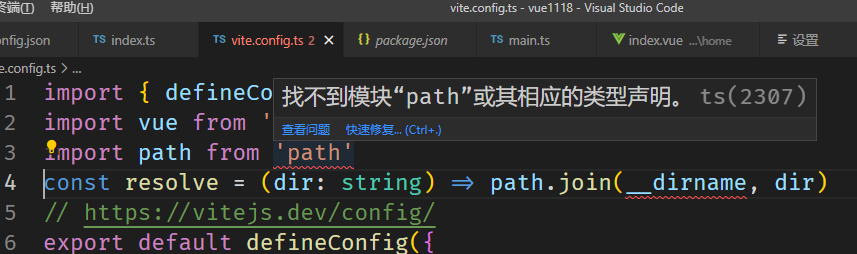

Vue3 学习笔记

##### vue3 中 父组件给子组件传参方式变化、传函数方式变化

1. - 父组件给子组件传参移除了sync
   - 子组件需要通过`emits`接收父组件传递过来的函数
   
2. 页面的过渡转场

   - 不同组件使用不同的过渡方式：将过渡方式从设置在`meta`上，然后结合`transition`的`name`属性实现

     ```js
     const routes = [
       {
         path: '/custom-transition',
         component: PanelLeft,
         meta: { transition: 'slide-left' },
       },
       {
         path: '/other-transition',
         component: PanelRight,
         meta: { transition: 'slide-right' },
       },
     ]
     ```

     ```vue
     <router-view v-slot="{ Component, route }">
       <!-- 使用任何自定义过渡和回退到 `fade` -->
       <transition :name="route.meta.transition || 'fade'">
         <component :is="Component" />
       </transition>
     </router-view>
     ```

   - 动态过渡：通过`router.afterEach`实现

     ```vue
     <!-- 使用动态过渡名称 -->
     <router-view v-slot="{ Component, route }">
       <transition :name="route.meta.transition">
         <component :is="Component" />
       </transition>
     </router-view>
     ```

     ```js
     router.afterEach((to, from) => {
       const toDepth = to.path.split('/').length
       const fromDepth = from.path.split('/').length
       to.meta.transitionName = toDepth < fromDepth ? 'slide-right' : 'slide-left'
     })
     ```

     

:question:找不到模块“path”或其相应的类型声明



```js
// 对node进行类型声明
yarn add @types/node -D
或者
npm i @types/node --D
```

